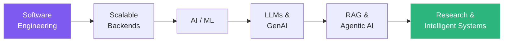

<p align="center">
  
</p>

<p align="center">
  <a href="https://github.com/apsariUdithara">
    
  </a>
</p>

<p align="center">
  <a href="https://www.linkedin.com/in/apsari-udithara/"></a>
  <a href="mailto:udithara169@gmail.com"></a>
  
</p>

---

## 👩‍💻 About me

```ts
const apsari = {
  role: "Software Engineer · AI/ML Engineer · Researcher",
  education:
    "BSc (Hons) Computer Engineering - University of Ruhuna, Sri Lanka",
  focus: [
    "LLM apps",
    "RAG",
    "Agentic & multi-agent systems",
    "Scalable backends",
  ],
  research: [
    "AI for cybersecurity",
    "Federated learning",
    "Intelligent networks",
  ],
  currently: "Turning my final-year research into papers 📝",
  openTo: ["AI/ML research", "Open source", "Backend & distributed systems"],
  funFact: "Top 12 in Sri Lanka at IEEEXtreme 18.0 🏆",
};
```

> [!TIP]
> I like combining solid software engineering with modern AI to build systems that are reliable enough for production, not just demos.

---

## 🚀 What I do

<table>
<tr>
<td width="50%" valign="top">

### 💻 Software Engineering

- Full-stack web apps & scalable backends
- RESTful APIs and microservices
- Event-driven & distributed systems
- Docker, cloud deployment & CI/CD
- Agile / Scrum teamwork

</td>
<td width="50%" valign="top">

### 🤖 AI & Machine Learning

- LLM-powered & Generative AI apps
- Agentic and multi-agent systems
- RAG pipelines for grounded answers
- Tool calling & multi-step workflows
- Anomaly detection & federated learning

</td>
</tr>
</table>

---

## 🛠️ Tech stack

<p align="center">
  
  <br/>
  
</p>

<details>
<summary><b>🧠 AI / ML toolbox</b> (click to expand)</summary>
<br/>

| Area               | Tools & topics                                                             |
| ------------------ | -------------------------------------------------------------------------- |
| **LLMs & GenAI**   | LangGraph · llama.cpp · Unsloth · RAG · Tool calling · Multi-agent systems |
| **ML / DL**        | Machine Learning · Deep Learning · NLP · Computer Vision                   |
| **Research areas** | Anomaly Detection · Federated Learning · Privacy-preserving AI             |
| **Serving**        | FastAPI · Docker                                                           |

</details>

<details>
<summary><b>⚙️ Backend, data & DevOps</b> (click to expand)</summary>
<br/>

| Area             | Tools & topics                                                            |
| ---------------- | ------------------------------------------------------------------------- |
| **Backend**      | Node.js · Express.js · NestJS · Java · Spring Boot · REST · Microservices |
| **Frontend**     | React · Next.js · TypeScript · Material UI · HTML5 · CSS3                 |
| **Databases**    | PostgreSQL · MySQL · MongoDB · Redis · Schema design · Query optimization |
| **DevOps**       | AWS · Docker · GitHub Actions · Jenkins · Linux · Bash                    |
| **Architecture** | Distributed systems · Event-driven design · Design patterns               |

</details>

---

## 📊 GitHub stats

<p align="center">
  
  
</p>

<p align="center">
  
</p>

---

## 🏆 Achievements

|     | Competition         | Result                                                        |
| --- | ------------------- | ------------------------------------------------------------- |
| 🥇  | **IEEEXtreme 18.0** | **12th in Sri Lanka** · **246th globally** among 6,500+ teams |
| 🏅  | **Haxtreme 2.0**    | Finalist - Top 10                                             |
| 🏅  | **Hackaholics 6.0** | Finalist - Top 10                                             |

<details>
<summary>👩‍💻 Other competitions</summary>
<br/>

IEEEXtreme 17.0 · CODESPRINT 8 · RED CYPHER 1.0 · Innovate with Ballerina · CODEFEST 2024

</details>

---

## 📚 Certifications

<p>
  
  
  
</p>

---

## 🌱 My learning path



---

## 🤝 Let's collaborate

I'm open to working together on **AI/ML research**, **Generative & Agentic AI**, **open-source projects**, **research publications**, and **scalable backend systems**.
The quickest way to reach me is [email](mailto:udithara169@gmail.com) or [LinkedIn](https://www.linkedin.com/in/apsari-udithara/).

---

<p align="center">
  <picture>
    <source media="(prefers-color-scheme: dark)" srcset="./profile/snake-dark.svg" />
    <source media="(prefers-color-scheme: light)" srcset="./profile/snake-light.svg" />
    
  </picture>
</p>

<p align="center">
  <i>Building software. Exploring AI. Conducting research. Learning continuously.</i>
</p>


